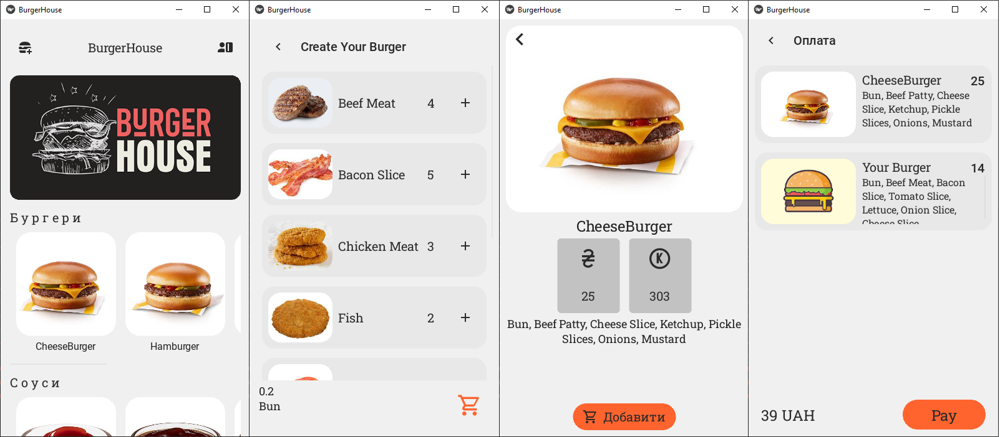

# App BurgerHouse
<i> All names are fictitious, coincidences are random, images of products are taken from the mcdonalds website or google</i>

---

## App photo

</img>

---

## About app
The program for ordering burgers has been automated, and it also contains a list with drinks, sweets, and sauces. The program contains 4 pages.
The main page contains the available products.
The information page, which displays full information about the product, and where you can add the product to the shopping list.
The page where you can create your own burger. At the same time, there is a limit on the addition of meat and all ingredients in general.
And the fourth page where the order is confirmed. It displays a list of added products to the cart, and you can also delete an item.

---

## What was used
```
PyCharm Community Edition 2023.1.1
python 3.9.10
kivy 2.1.0
kivymd 1.1.1
The project uses the MVC architectural pattern
```

---

## Team that created the project

```bash
python -m kivymd.tools.patterns.create_project \
    MVC \
    path \
    BurgerHouse \
    python3.9 \
    2.1.0 \
    --name_screen MainScreen InfoScreen CreateScreen PayScreen
```

---


